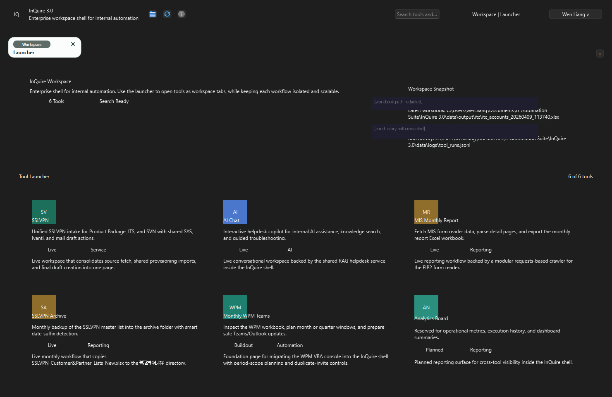
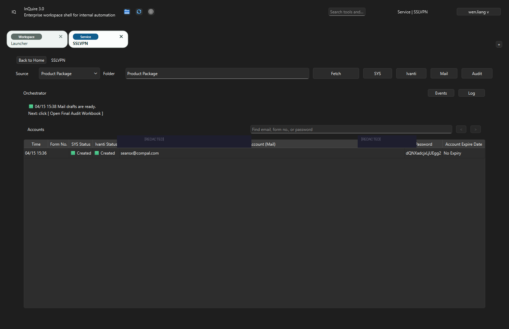
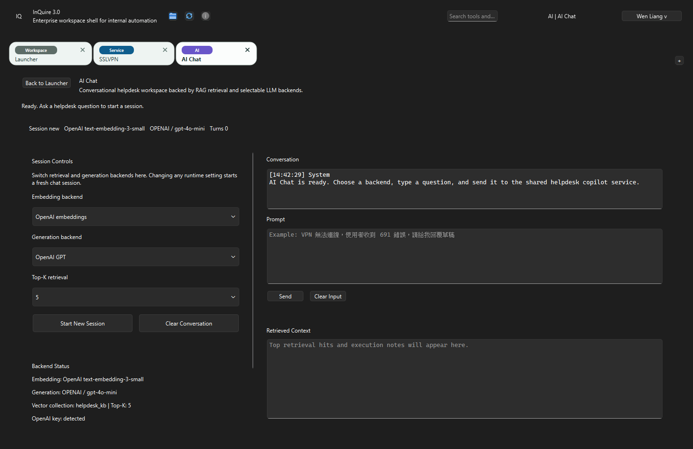
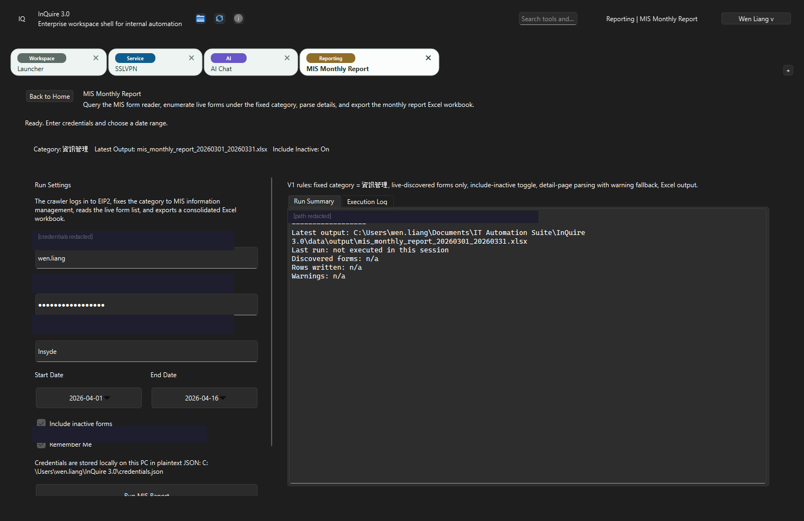

# Enterprise IT Helpdesk Automation Workbench — Portfolio Evidence

> Target role reference: **OO有限公司 (OO Co., Ltd.)** via OO人力銀行
> Applicant: 梁瀚文 (Wen Liang)
> Package type: **Portfolio evidence repo** (public-safe adaptation of real internal work)

---

<!-- 
  中文導讀：這份 repo 不是教學範本，不是 side project，也不是從 YouTube 看來的練習。
  這是一套在台灣企業內部實際跑過、每天有人在用的 IT 自動化工具的去識別化公開版本。
  每一張截圖都是真的執行畫面，每一段程式碼都是真的 commit history。
  如果你只有 5 分鐘，往下拉到「給非技術背景的讀者」那段。
-->

## Summary

I turn fragmented, ticket-driven internal IT operations into **batch-first, deterministic workflows** that an IT team can run, audit, and hand off safely. This package is the public-safe proof layer for work I have already shipped inside a Taiwan enterprise environment — covering email-driven account provisioning, helpdesk ticket automation, VPN / identity remediation, bulk Outlook communication, and AI-assisted classification.

The focus is not "I can write scripts." The focus is: I can take a messy day-to-day IT support process, break it into a workflow, attach clear ownership, and leave behind a system the next operator can keep running.

> **一句話中文版：** 我把每天重複做到煩的 IT 日常（開帳號、寄通知信、分類退信、修電腦）變成一套別人接手也能跑的自動化系統。不是寫寫 script 就結束，是從分析流程、合併資料、做決策、執行、驗證、到交接文件，整條都做完。

---

## The problem (before) ｜ 改善前的痛點

Inside a corporate IT / helpdesk team, repetitive user-facing work pulls a disproportionate share of engineer time:

- **Account lifecycle**: SSL-VPN, SVN, FTP, H2OIDE, Ivanti, Product Package — each system has its own form, its own approval flow, its own credential email.
- **Ticket follow-through**: each request spawned a manual email with manually attached PDFs, manually composed templates, and manually copied account IDs.
- **Inbox triage**: hundreds of bounce emails, training-completion confirmations, audit requests — all surviving on individual memory.
- **Environment fixes**: Teams sign-in loops, Pulse Secure stuck caches, OneDrive policy toggles, ESET cleanup — each one a manual runbook that lived in someone's head.

Result: inconsistent handling, repeated back-and-forth, single-person knowledge concentration, and no audit trail when things went wrong.

> **白話中文：**
> 想像你開一間店，客服、上架、出貨、盤點全部靠同一個人，而且那個人的 SOP 全存在腦子裡。
> 他請假的那天，整間店就停擺。
> 這就是改善前的狀態 —— 七套系統、七種信件、七種 PDF 附件，全部手動。
> 每一張票都要開十幾個視窗，複製貼上，然後「應該沒忘記什麼吧」。

---

## The solution (what I built) ｜ 我做了什麼

A layered workbench that treats user requests as **batches, not tickets**:

1. **Normalize** inbound requests (Outlook mailboxes, Excel workbooks, EIP2 / Ivanti exports) into a single row shape.
2. **Deduplicate and merge** before any external write, so no account gets double-provisioned.
3. **Decide** `create / skip / review` deterministically — the operator only touches the exception queue.
4. **Execute** via deterministic adapters (Outlook COM, pywin32, Playwright, Ivanti API, SSLVPN provisioning endpoints).
5. **Verify and readback** — every write is confirmed, every failure surfaces a bounded debug bundle.
6. **Generate communication artifacts** (confirmation emails, PDFs, meeting invites) only from verified results.
7. **Observe** — execution summary, telemetry, replayable artifacts kept in private environments only.

> **白話中文（用營運的語言講）：**
> 1. **收單** —— 不管需求從 email、Excel、還是內部系統來，全部先變成同一種格式。就像你不管客人從蝦皮、官網、還是 Line 下單，都先進同一張訂單表。
> 2. **去重** —— 同一個人出現兩次？合併，不會重複處理。就像同一筆訂單不會出兩次貨。
> 3. **分類決策** —— 系統自動分「可以直接做」「要人看一下」「不用做」三種。操作員只碰「要人看一下」那一疊。
> 4. **執行** —— 自動幫你開帳號、寄信、簽核。不是按一個鍵喊自動化，是每個動作結束後都會「回頭確認真的做成了」。
> 5. **結果報告** —— 做完產出一張表：建了幾個、跳過幾個、需要主管看的幾個。每筆都有理由。
>
> **這套邏輯不是只能用在 IT。** 任何需要「收單→整理→判斷→執行→回報」的營運流程都能用同一個骨架。

---

## What was delivered (highest-impact items) ｜ 實際交付了什麼

<!-- 以下每一個模組都是真的在跑的工具，不是「我規劃了一個系統」，是「我做完了而且別人在用」。 -->

### InQuire 3.0 — Desktop workbench (PySide6, 4 domain workflows)
#### ｜ 桌面工作站：一個 app 同時跑四個業務流程

PySide6 tabbed desktop shell orchestrating Product Package ETL, SYS SSLVPN batch import, Ivanti Local User, and WPM meeting scheduling. Private source; sanitized derivative in sibling demo repo.

> **用人話說：** 你面前這個深色介面的桌面程式，就是我從零寫出來的工具。裡面有 6 個模組（帳號開通、AI 客服、月報產出、VPN 備份、會議排程、數據看板）。操作員每天打開它，用它處理日常業務，不需要同時開七個網頁。

**The actual running application** — this is what the operator sees every day:

**↓ 這是真的在跑的應用程式截圖，不是 Figma 或設計稿 ↓**

> Home screen with 6 tool cards: SSLVPN provisioning, AI Chat helpdesk, MIS Monthly Report, SSLVPN Archive, WPM Teams meeting scheduler, Analytics Board. Each card shows its live/planned status and description.
>
> **中文：** 首頁的 6 張工具卡片，每一張對應一個業務模組。綠色標籤 = 已上線在跑；灰色 = 開發中。點進去就是該模組的操作介面。

> SSLVPN tool open: Source selector (Product Package), Fetch/SYS/Ivanti/Mail/Audit action buttons, Orchestrator status bar, and Accounts table showing created records. Credentials redacted.
>
> **中文：** 帳號開通模組。上方一排按鈕就是整個流程的步驟（抓單→寫入系統→寫入VPN→產信件→稽核），下方表格是跑完的結果。操作員看到的是「這個人的帳號開好了、信件草稿產好了」，不是程式碼。敏感資訊已塗黑。

> AI Chat tab: OpenAI embeddings + gpt-4o-mini backend, conversation window, prompt input, retrieved context panel. This is the internal helpdesk copilot backed by vector search over the knowledge base.
>
> **中文：** AI 客服模組。左邊選模型（OpenAI），右邊是對話視窗。員工問「VPN 連不上怎麼辦」，AI 去知識庫找到相關文件，給出回答。回答不了的才進工單。等於在工單前面加了一層「先問 AI」。

> MIS Monthly Report tool: login form, date range picker, Run Summary with discovered forms / rows written / warnings. Outputs a consolidated Excel workbook. Credentials redacted.
>
> **中文：** 月報產出模組。選日期範圍、按「Run」，系統自動登入內部入口網站、把表單資料抓下來、整理成 Excel。以前這件事要點 30 分鐘的網頁，現在一個按鈕。密碼欄位已塗黑。

**Project internals** (code structure, not just GUI):
#### ｜ 不只是畫面漂亮 — 這是背後的程式架構

> **中文：** 檔案結構。每一層有分工：`jobs/` 是業務邏輯、`core/` 是共用工具、`ui/` 是介面、`config/` 是設定。不是把所有東西塞在一個檔案裡。

> **中文：** 分層設計：業務邏輯（jobs）、共用核心（core）、畫面（ui）、設定（config）各自獨立。新增一個業務模組，不需要動到其他模組。就像你加一個新的出貨管道，不需要重寫客服系統。

---

### AI-Based Email Behavior Classification Engine
#### ｜ AI 退信分類引擎：自動判斷哪些帳號該刪、哪些該留

AI + few-shot + firewall-immunity pattern matcher that buckets SSL-VPN bounce emails into `DELETE / REVIEW / KEEP`.

> **白話中文：** 每個月系統寄幾千封帳號到期通知，退回來幾百封。但「退信」不代表帳號死了 —— 可能是防火牆擋的、DNS 暫時壞了、信箱滿了。以前是人工一封一封看。現在 AI 先分類：「確定死了→刪」「可能只是暫時問題→留」「不確定→給人看」。規則透明、附理由、有 Strict Mode 雙重把關。

> **中文：** 上面是檔案結構，下面是核心分析程式的開頭。`samples/` 資料夾裡放的是「黃金範本」—— AI 拿這些範本去比對新的退信，判斷相似度。不是靠關鍵字硬幹，是語意比對。

---

### EIP2_report — 5-stage provisioning pipeline
#### ｜ 帳號開通五階段 pipeline：20 步手工變 1 次執行

Cerberus FTP export → EIP2 form fetch → merge → Outlook draft generation → batch form sign-off. Collapses a 20-step manual task into one operator run.

> **白話中文：**
> 以前開一個 FTP 帳號要做 20 步（登入 Cerberus 匯出帳號表→登入內部網站查申請單→比對→開帳號→密碼產生→寫信→附 PDF→簽核表單……）。
> 現在是 5 個 Python 腳本按順序跑：抓→比→合→寄→簽。一次搞定，中間的決策邏輯（這個人要新建還是改密碼還是不用動）全部有程式判斷、有 log、有原因紀錄。

> **中文：** 每個檔案名稱就是一個步驟（1.抓帳號表 → 2.抓申請單 → 3.合併處理 → 4.產信件草稿 → 5.批次簽核）。不是一大坨程式碼，是五個獨立腳本，任何一步出問題可以單獨重跑。

---

### outlook_file_download — OCR enrollment tool
#### ｜ OCR 課程登錄工具：從 100 封 email 裡自動抓圖、辨字、填表

Tkinter + Tesseract OCR + Outlook COM: extracts training-certificate images, fuzzy-matches course names, auto-fills the enrollment roster Excel.

> **白話中文：** 每年資安訓練完成後，HR 需要確認誰上了什麼課。以前是打開 100 封 email、一張一張看證書截圖、手動填進 Excel。現在這個工具自動從 Outlook 抓信件、用 OCR 辨識證書圖片上的課程名稱（中英文混雜也能辨識），然後 fuzzy match 到課程代碼，直接填入名冊。命中率從 60% 提升到 95%。

> **中文：** 注意 `Tesseract-OCR/` 資料夾 —— 這是圖像文字辨識引擎的本體。整套工具的 GUI 是用 Python Tkinter 寫的，操作員選日期範圍、按一個鈕就跑完全部。

---

### Confirmation email suite (7 systems)
#### ｜ 確認信自動發送套件：7 套系統、每套一個 VBA 巨集

VBA macros for FTP / InQuire / ITS / Product Package / SVN / VPN_Internal / WPM. Bulk credential distribution with HTML templates, multi-PDF attachments, BCC-chunking (200-per-draft).

> **白話中文：** 每次開完帳號，要寄一封「您的帳號已建立」的信，附上密碼、使用說明 PDF、相關設定。七套系統、七種信件模板、七種 PDF 組合。以前手動拖附件、手動編 BCC。現在每套系統有自己的 VBA 巨集，從 Excel 讀名單，自動組裝信件，200 人一批（避開郵件伺服器限制），按一鍵就全產好放在寄件匣等你看一眼再送出。

> **中文：** 7 個資料夾 = 7 套系統的信件自動化。每個裡面都有對應的 VBA 模組和使用說明。

---

### Helpdesk first-aid toolkit
#### ｜ IT 急救工具箱：把「只有老鳥知道怎麼修」變成「誰都能按的一鍵修復」

`Teams_Full_Reset.bat`, `fix_pulse_secure.bat` — one-click fixes that replace tribal knowledge runbooks.

> **白話中文：**
> - Teams 登不進去？以前要清 5 個 cache 資料夾 + 3 個 registry key + 刪 credential manager 裡的 token。新人不知道要清哪個、順序是什麼。現在雙擊 `Teams_Full_Reset.bat`，它全部幫你做完並且記 log。
> - VPN 連不上？一樣，`fix_pulse_secure.bat` 殺進程、清 cache、重啟服務、五步到位。
>
> 這不是什麼高深技術。但這就是**「營運現場」**—— 把藏在某個人腦子裡的修法寫成任何人能跑的工具，這才叫**落地**。

> **中文：** 真實程式碼。每一步都有註解、有 log、有錯誤處理。不是 Stack Overflow 複製貼上。

---

### Enterprise Provisioning Workbench Demo (public, runnable)
#### ｜ 公開可執行的 demo：你現在就可以跑看看

Sanitized derivative with the same normalize → merge → decide → execute → verify spine. `python -m demo_app --show-stages` runs end-to-end.

> **白話中文：** 上面那些工具都是內部的，不能直接給你跑。但這個 demo 用同一套架構、同一套邏輯，只是把真實的系統連線換成假資料。你在自己的電腦上執行 `python -m demo_app --show-stages`，就會看到完整的「收單→去重→決策→執行→報告」流程，跑出來的結果跟真的一模一樣。

> **中文：** 這是我剛剛真的跑出來的結果。不是截圖修圖，不是文件裡寫的「理論上會長這樣」。你拉到 `Action Board` 那段：alice.chen → CREATE、carol.lin → REVIEW（因為 ADMIN 權限需要人看）、existing-bob.wu → SKIP（帳號已存在）。每一個決策都附理由。

---

## Why it matters operationally ｜ 對營運有什麼實際影響

- Repeated handling dropped from "one engineer, one ticket, one copy-paste" to **batch runs with an exception queue**.
- Account provisioning is **deterministic and auditable** — every decision is `create / skip / review` with a reason string.
- New operators can be onboarded from docs, not from shadowing — handoff is real.
- AI layer assists extraction and classification, but **never performs the final system write**. Safety boundary is explicit.

> **白話中文：**
> - 以前一張票做 20 分鐘，現在一批票做 2 分鐘，人只看「需要確認」那一疊。
> - 做過什麼有紀錄、每個決定有理由，出事能查。
> - 新人不用跟著老鳥學三個月，讀文件跑 demo 就能上手。
> - AI 只幫你分類和建議，**最後按下去的都是人**。這是我的設計原則，不是偷懶沒做。

---

## Tech stack (what I actually used) ｜ 技術清單（只列真的用過的）

- **Languages**: Python 3.11 (main), VBA (Outlook/Word/Excel), PowerShell, Windows batch, TypeScript (Next.js for 104 side).
- **Desktop**: PySide6 / PyQt6, Tkinter, Win32 COM via `pywin32`.
- **Browser/UI automation**: Playwright (persistent context, Chromium), Selenium + webdriver-manager (legacy), Chrome DevTools Protocol over WebSocket.
- **AI / LLM**: OpenAI `gpt-4o-mini`, Anthropic Claude (RAG), `chromadb`, `sentence-transformers`.
- **HTTP**: `requests` + custom `RetrySession` (exponential back-off for Cloudflare 403).
- **Data**: SQLite (`applied_history.db`), `openpyxl`, `pandas`, CSV pipelines.
- **OCR**: Tesseract (`pytesseract`), OpenCV, Pillow.
- **Testing**: `pytest` (755 passed on 104 side; 90+ integration tests in InQuire 3.0).
- **Observability**: structured JSON logs, telemetry snapshots, replay-friendly debug bundles.

> **非技術版：** Python 為主、搭配 Excel 巨集和 Windows 腳本。AI 用 OpenAI 和 Claude。瀏覽器自動化用 Playwright。資料庫用 SQLite（輕量、不用裝伺服器）。每次改動前跑 755 個自動測試確認沒壞東西。

---

## Repository guide ｜ 這個 repo 裡有什麼、先看哪個

| File 檔案 | What it is 是什麼 |
|------|-----------|
| [`CASE_STUDY.md`](CASE_STUDY.md) | 完整案例敘述（14 個段落，從背景到交接） Full narrative: background → problem → analysis → solution → challenges → result → handoff. |
| [`FOR_BENWAN.md`](FOR_BENWAN.md) | **5+1 題直接回答**（針對 104 對話裡提出的 5 個問題，加上我補的第 6 題）Direct answers to the 5 questions from the 104 conversation, plus a 6th I added. |
| [`JD_ALIGNMENT.md`](JD_ALIGNMENT.md) | 職缺對照表（你說的每一句話 → 我 repo 裡哪個位置有證據）Direct mapping from the role's expectations to evidence in this repo. |
| [`TECH_STACK.md`](TECH_STACK.md) | 技術清單（用了什麼、為什麼用、能不能公開）Complete technology inventory with role, reason, and public visibility flag. |
| [`SYSTEM_OVERVIEW.md`](SYSTEM_OVERVIEW.md) | 改善前 vs 改善後的流程圖（Mermaid）Before / after workflow view + component diagram. |
| [`SCREENSHOT_INDEX.md`](SCREENSHOT_INDEX.md) | 每張截圖的說明（拍什麼、證明什麼、有沒有修圖）What each screenshot shows, which claim it backs, redaction status. |
| [`SETUP.md`](SETUP.md) | 怎麼在你自己電腦上跑 demo How to run the sanitized demo path locally. |
| [`SANITIZATION_NOTES.md`](SANITIZATION_NOTES.md) | 脫敏說明（刪了什麼、改了什麼、為什麼）What was removed, renamed, mocked, or reconstructed — and why. |
| [`docs/`](docs/) | 流程圖、交接說明、五階段詳解 Workflow diagrams, handoff notes, process breakdown. |
| [`examples/`](examples/) | 去識別化的範例輸入／輸出 JSON Sanitized sample input and output. |

> **如果你只看一個檔案：** 看 [`FOR_BENWAN.md`](FOR_BENWAN.md)。那個就是按你問的 5 題格式寫的，第 6 題是我加的。

---

## Real test evidence ｜ 測試證據（真的跑出來的，不是 CI 徽章）

All from actual `pytest` / `unittest` runs on this machine, not CI badges:

> **中文：** 下面三張圖是在我這台電腦上真的跑測試的結果。755 個測試全過 = 修改任何東西之前，我有 755 個自動檢查確認原本的功能沒壞。這不是掛好看的，是我每次改 code 之前都會跑的。

---

## 104 IT Automation Suite — full scope ｜ 完整專案範圍

20+ sub-projects under one parent folder:

> **中文：** 這不是一個小 project —— IT Automation Suite 底下有 20 幾個子專案。上面只挑了最核心的幾個講。完整列表在下面。

---

## 給非技術背景的讀者（For non-technical reviewers）

**如果你不看程式碼，看這段就好：**

1. **上面那些深色截圖** = 我從零寫出來、每天在用的桌面應用程式。不是網站，是裝在電腦上跑的操作工具。
2. **首頁 6 張工具卡片** = 6 個不同的自動化模組，全部整合在同一個 app 裡。
3. **SSLVPN 那一頁** = 帳號開通的地方。以前一張一張手動開，現在整批處理、自動判斷、自動寄信。
4. **AI Chat 那一頁** = 員工問 IT 問題，AI 先從知識庫找答案。答不了才建工單。減少重複問答。
5. **755 個測試全過** = 每次改動前，系統會自動跑 755 個測試，確認沒有改壞原本的功能。這是品質保證。
6. **[`FOR_BENWAN.md`](FOR_BENWAN.md)** = 我針對 104 對話裡那 5 個問題的逐題回答，加上我自己補的第 6 題。

> **還有一件事你可能想知道的：**
> 在準備這份公開資料的同一天（2026-04-15），我順手做了兩件維護工作：
> - 發現 3 個歷史遺留的密碼外洩（寫死在程式裡的密碼），當天全部輪替並改成環境變數讀取
> - 修復一個 Outlook 會議邀請重複寄送的 bug，11 個回歸測試全過
>
> 我把這件事寫出來，不是為了炫耀，是因為**這就是「後續維護與優化」最真實的樣子**：自己以前犯的設計錯誤，自己抓出來、自己修好、自己寫紀錄。

---

## Notes on public-safe adaptation ｜ 公開安全聲明

This package is a **portfolio evidence repo**, not a full source dump. The underlying workflows are real and in production; internal hostnames, tenant IDs, credentials, customer identifiers, and raw HTML traces are deliberately excluded. See [`SANITIZATION_NOTES.md`](SANITIZATION_NOTES.md) for the full boundary.

A companion sanitized code repo exists at `../enterprise-provisioning-workbench-demo/` with runnable Python CLI + tests and a reproducible `create / skip / review` workflow.

> **白話中文：** 這份 repo 故意不放原始碼的全部。公司名、主機名、員工資料、密碼全部拿掉了。但架構是真的、邏輯是真的、截圖是真的。想看能跑的程式，請看姐妹 demo repo。

## Links ｜ 連結

- **This repo (case study + 5-question answer)**: <https://github.com/islanderwalk/enterprise-helpdesk-automation-workbench-case>
- **Sibling runnable demo 姐妹可執行 demo**: <https://github.com/islanderwalk/enterprise-provisioning-workbench-demo>
- **Direct answer to 5+1 questions 五題直答+第六題**: [`FOR_BENWAN.md`](FOR_BENWAN.md)

## GitHub profile visibility ｜ 同一個 GitHub 帳號下的其他 repo

Visible repos (from public GitHub profile):

> **中文：** 同一個 GitHub 帳號下還有其他專案，不是只有這一個 repo。包括 InQuire 3.0（私有）、Email 分類引擎、BIOS 工具、英語學習 AI Toolkit 等。每一個都是真的有在維護的，不是開了就放著。

Shown: `enterprise-provisioning-workbench-demo` (public sanitized derivative), `InQuire-3.0` (private flagship source), `Outlook-Email-Behavior-Classification-Engine` (AI email triage), `BMC_BIOS_1213`, `EnglishAI-Toolkit`, `ai-short-video-mvp`, and profile repo `islanderwalk/islanderwalk`. Each maps to a section in [`TECH_STACK.md`](TECH_STACK.md) or [`CASE_STUDY.md`](CASE_STUDY.md).
