# Enterprise IT Helpdesk Automation Workbench — Portfolio Evidence

> Target role reference: **OO有限公司 (OO Co., Ltd.)** via OO人力銀行
> Applicant: 梁瀚文 (Wen Liang)
> Package type: **Portfolio evidence repo** (public-safe adaptation of real internal work)

---

## Summary

I turn fragmented, ticket-driven internal IT operations into **batch-first, deterministic workflows** that an IT team can run, audit, and hand off safely. This package is the public-safe proof layer for work I have already shipped inside a Taiwan enterprise environment — covering email-driven account provisioning, helpdesk ticket automation, VPN / identity remediation, bulk Outlook communication, and AI-assisted classification.

The focus is not "I can write scripts." The focus is: I can take a messy day-to-day IT support process, break it into a workflow, attach clear ownership, and leave behind a system the next operator can keep running.

---

## The problem (before)

Inside a corporate IT / helpdesk team, repetitive user-facing work pulls a disproportionate share of engineer time:

- **Account lifecycle**: SSL-VPN, SVN, FTP, H2OIDE, Ivanti, Product Package — each system has its own form, its own approval flow, its own credential email.
- **Ticket follow-through**: each request spawned a manual email with manually attached PDFs, manually composed templates, and manually copied account IDs.
- **Inbox triage**: hundreds of bounce emails, training-completion confirmations, audit requests — all surviving on individual memory.
- **Environment fixes**: Teams sign-in loops, Pulse Secure stuck caches, OneDrive policy toggles, ESET cleanup — each one a manual runbook that lived in someone's head.

Result: inconsistent handling, repeated back-and-forth, single-person knowledge concentration, and no audit trail when things went wrong.

---

## The solution (what I built)

A layered workbench that treats user requests as **batches, not tickets**:

1. **Normalize** inbound requests (Outlook mailboxes, Excel workbooks, EIP2 / Ivanti exports) into a single row shape.
2. **Deduplicate and merge** before any external write, so no account gets double-provisioned.
3. **Decide** `create / skip / review` deterministically — the operator only touches the exception queue.
4. **Execute** via deterministic adapters (Outlook COM, pywin32, Playwright, Ivanti API, SSLVPN provisioning endpoints).
5. **Verify and readback** — every write is confirmed, every failure surfaces a bounded debug bundle.
6. **Generate communication artifacts** (confirmation emails, PDFs, meeting invites) only from verified results.
7. **Observe** — execution summary, telemetry, replayable artifacts kept in private environments only.

---

## What was delivered (highest-impact items)

### InQuire 3.0 — Desktop workbench (PySide6, 4 domain workflows)

PySide6 tabbed desktop shell orchestrating Product Package ETL, SYS SSLVPN batch import, Ivanti Local User, and WPM meeting scheduling. Private source; sanitized derivative in sibling demo repo.

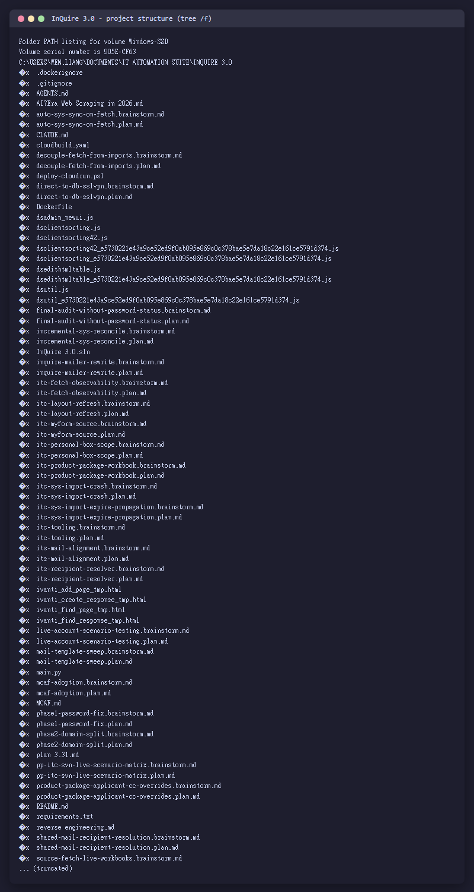
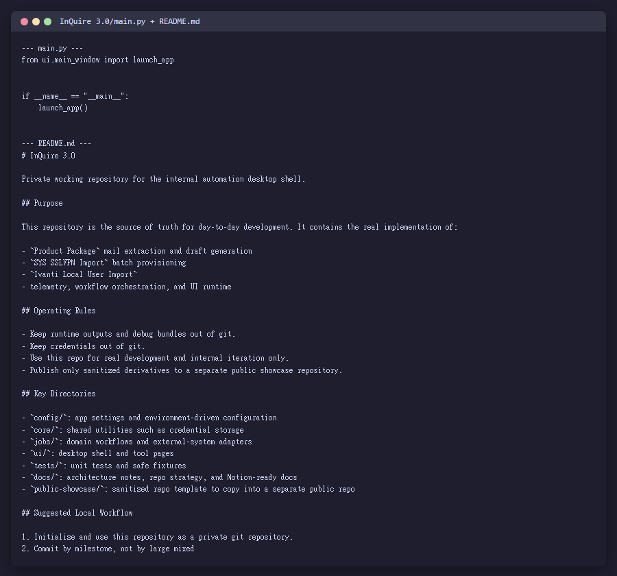
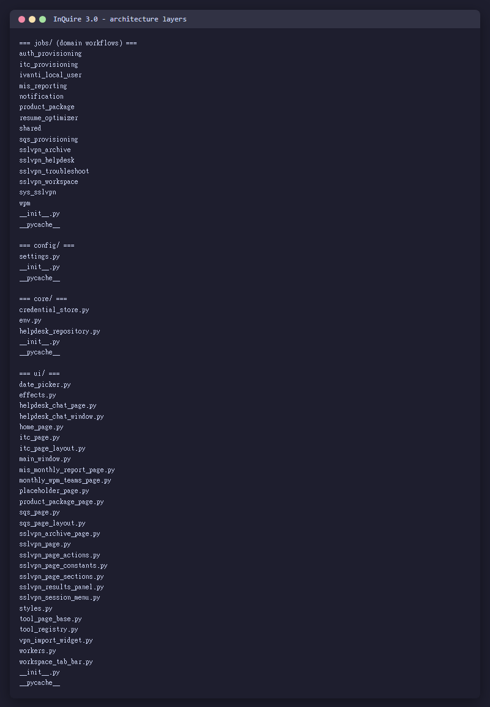

---

### AI-Based Email Behavior Classification Engine

AI + few-shot + firewall-immunity pattern matcher that buckets SSL-VPN bounce emails into `DELETE / REVIEW / KEEP`.

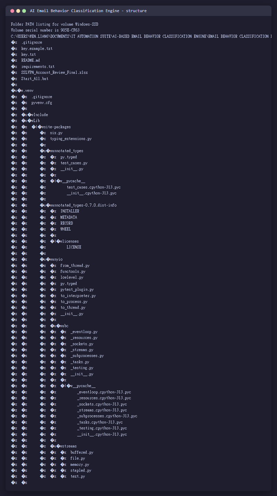
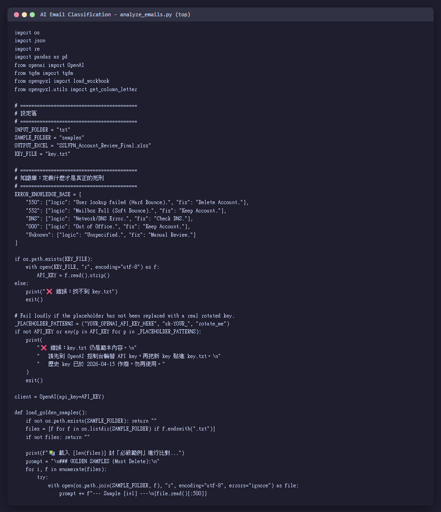

---

### EIP2_report — 5-stage provisioning pipeline

Cerberus FTP export → EIP2 form fetch → merge → Outlook draft generation → batch form sign-off. Collapses a 20-step manual task into one operator run.

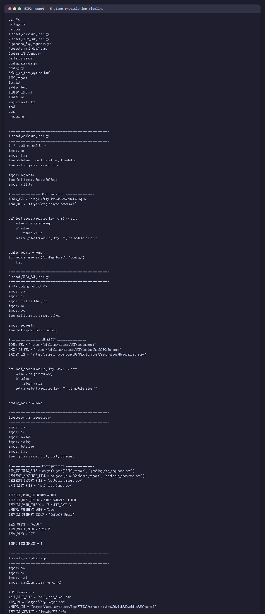

---

### outlook_file_download — OCR enrollment tool

Tkinter + Tesseract OCR + Outlook COM: extracts training-certificate images, fuzzy-matches course names, auto-fills the enrollment roster Excel.

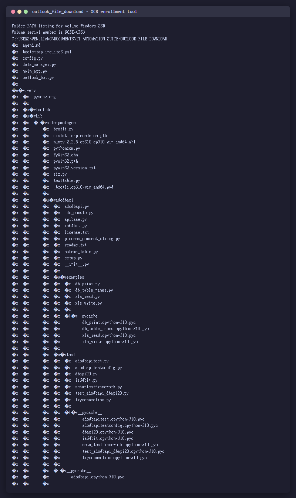

---

### Confirmation email suite (7 systems)

VBA macros for FTP / InQuire / ITS / Product Package / SVN / VPN_Internal / WPM. Bulk credential distribution with HTML templates, multi-PDF attachments, BCC-chunking (200-per-draft).

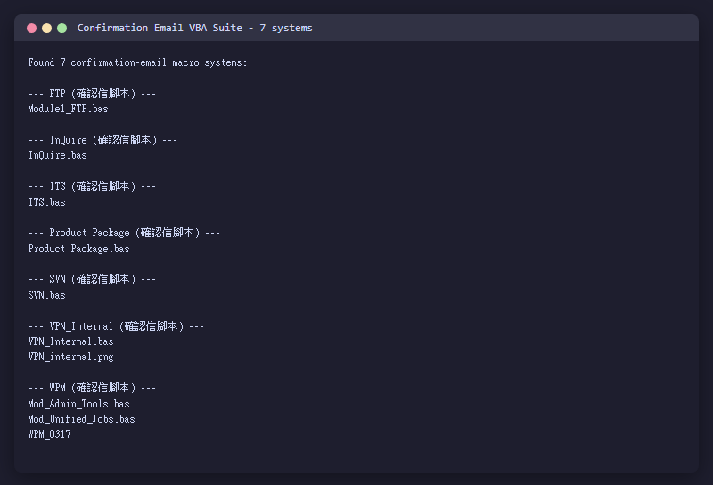

---

### Helpdesk first-aid toolkit

`Teams_Full_Reset.bat`, `fix_pulse_secure.bat` — one-click fixes that replace tribal knowledge runbooks.

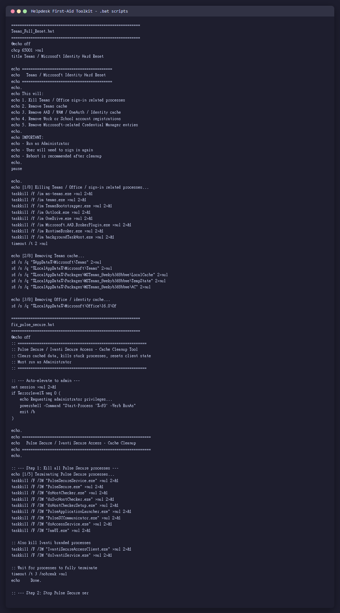

---

### Enterprise Provisioning Workbench Demo (public, runnable)

Sanitized derivative with the same normalize → merge → decide → execute → verify spine. `python -m demo_app --show-stages` runs end-to-end.

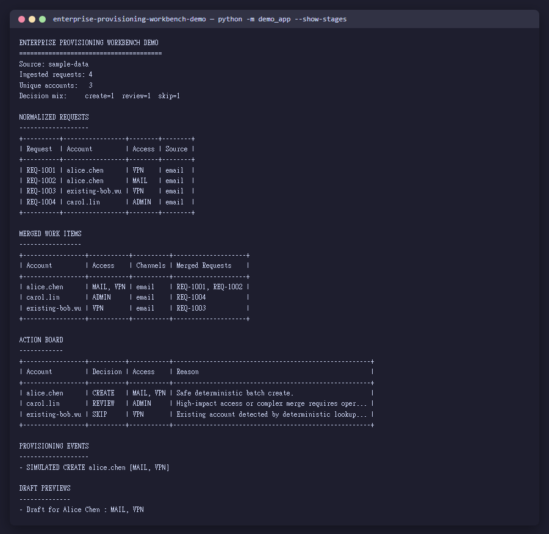

---

## Why it matters operationally

- Repeated handling dropped from "one engineer, one ticket, one copy-paste" to **batch runs with an exception queue**.
- Account provisioning is **deterministic and auditable** — every decision is `create / skip / review` with a reason string.
- New operators can be onboarded from docs, not from shadowing — handoff is real.
- AI layer assists extraction and classification, but **never performs the final system write**. Safety boundary is explicit.

---

## Tech stack (what I actually used)

- **Languages**: Python 3.11 (main), VBA (Outlook/Word/Excel), PowerShell, Windows batch, TypeScript (Next.js for 104 side).
- **Desktop**: PySide6 / PyQt6, Tkinter, Win32 COM via `pywin32`.
- **Browser/UI automation**: Playwright (persistent context, Chromium), Selenium + webdriver-manager (legacy), Chrome DevTools Protocol over WebSocket.
- **AI / LLM**: OpenAI `gpt-4o-mini`, Anthropic Claude (RAG), `chromadb`, `sentence-transformers`.
- **HTTP**: `requests` + custom `RetrySession` (exponential back-off for Cloudflare 403).
- **Data**: SQLite (`applied_history.db`), `openpyxl`, `pandas`, CSV pipelines.
- **OCR**: Tesseract (`pytesseract`), OpenCV, Pillow.
- **Testing**: `pytest` (587/587 green on 104 side; 90+ integration tests in InQuire 3.0).
- **Observability**: structured JSON logs, telemetry snapshots, replay-friendly debug bundles.

---

## Repository guide

| File | What it is |
|------|-----------|
| [`CASE_STUDY.md`](CASE_STUDY.md) | Full narrative: background → problem → analysis → solution → challenges → result → handoff. |
| [`JD_ALIGNMENT.md`](JD_ALIGNMENT.md) | Direct mapping from the role's expectations to evidence in this repo. |
| [`TECH_STACK.md`](TECH_STACK.md) | Complete technology inventory with role, reason, and public visibility flag. |
| [`SYSTEM_OVERVIEW.md`](SYSTEM_OVERVIEW.md) | Before / after workflow view + component diagram. |
| [`SCREENSHOT_INDEX.md`](SCREENSHOT_INDEX.md) | What each screenshot shows, which claim it backs, redaction status. |
| [`SETUP.md`](SETUP.md) | How to run the sanitized demo path locally. |
| [`SANITIZATION_NOTES.md`](SANITIZATION_NOTES.md) | What was removed, renamed, mocked, or reconstructed — and why. |
| [`docs/`](docs/) | Workflow diagrams, handoff notes, process breakdown. |
| [`examples/`](examples/) | Sanitized sample input and output. |

---

## Real test evidence

All from actual `pytest` / `unittest` runs on this machine, not CI badges:

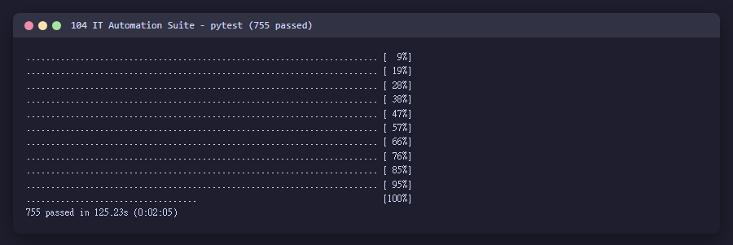
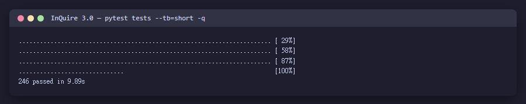
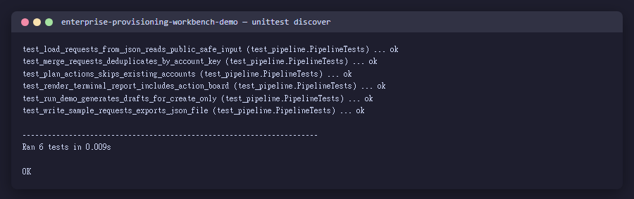

---

## 104 IT Automation Suite — full scope

20+ sub-projects under one parent folder:

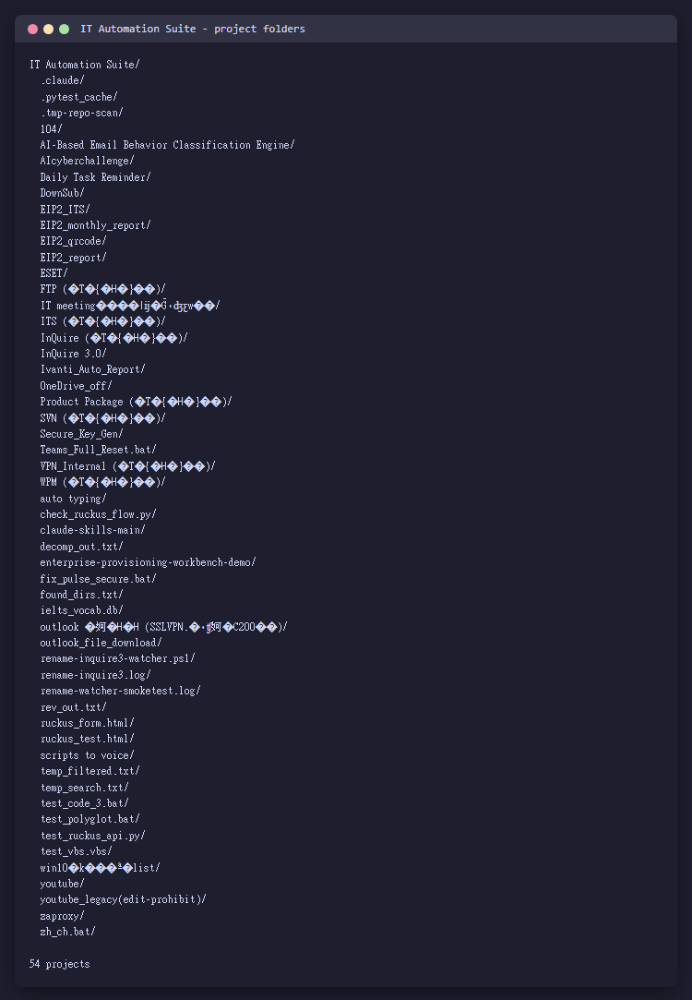
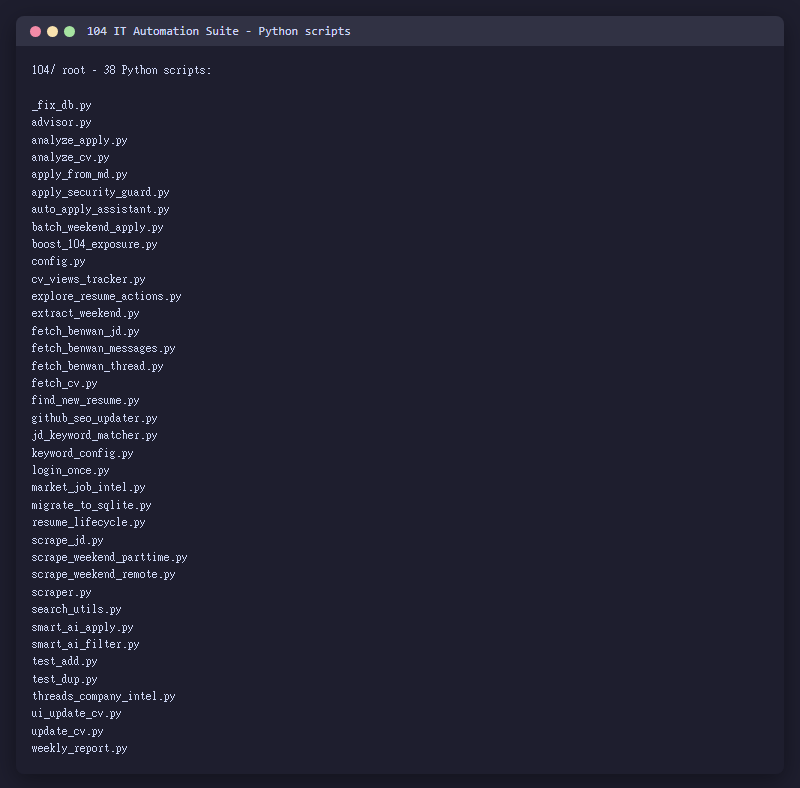

---

## Notes on public-safe adaptation

This package is a **portfolio evidence repo**, not a full source dump. The underlying workflows are real and in production; internal hostnames, tenant IDs, credentials, customer identifiers, and raw HTML traces are deliberately excluded. See [`SANITIZATION_NOTES.md`](SANITIZATION_NOTES.md) for the full boundary.

A companion sanitized code repo exists at `../enterprise-provisioning-workbench-demo/` with runnable Python CLI + tests and a reproducible `create / skip / review` workflow.

## Links

- **This repo (case study + 5-question answer)**: <https://github.com/islanderwalk/enterprise-helpdesk-automation-workbench-case>
- **Sibling runnable demo**: <https://github.com/islanderwalk/enterprise-provisioning-workbench-demo>
- **Direct answer to 本萬 5 題**: [`FOR_BENWAN.md`](FOR_BENWAN.md)

## GitHub profile visibility

Visible repos (from public GitHub profile):

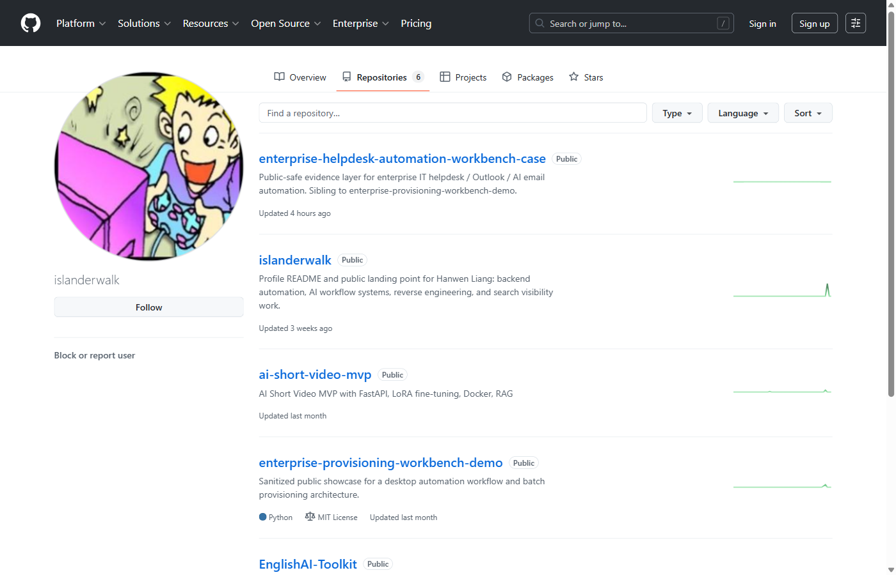

Shown: `enterprise-provisioning-workbench-demo` (public sanitized derivative), `InQuire-3.0` (private flagship source), `Outlook-Email-Behavior-Classification-Engine` (AI email triage), `BMC_BIOS_1213`, `EnglishAI-Toolkit`, `ai-short-video-mvp`, and profile repo `islanderwalk/islanderwalk`. Each maps to a section in [`TECH_STACK.md`](TECH_STACK.md) or [`CASE_STUDY.md`](CASE_STUDY.md).
