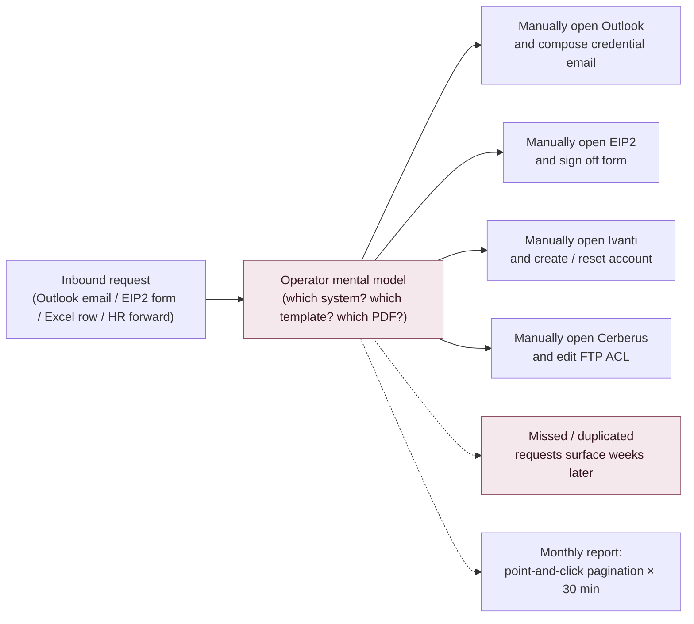
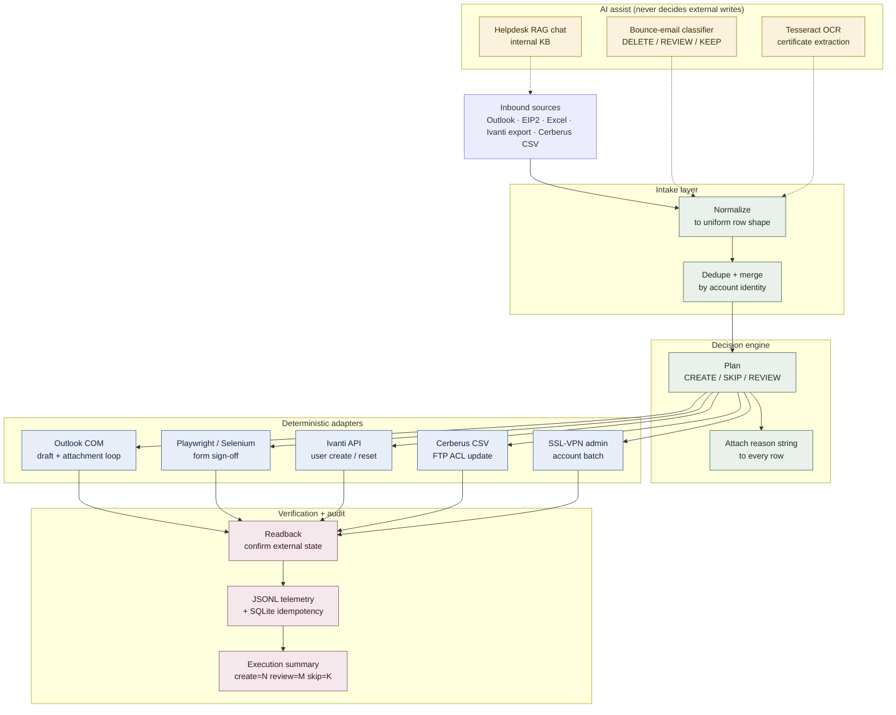

# System Overview

Top-level explanation of how the workbench changes the shape of internal IT operations. Written for a hiring manager, not for a peer engineer.

---

## How the workflow operated *before*

**Pain.** Every inbound request round-tripped through one operator's mental model. No normalization, no dedup, no readback. Monthly reports were a separate 30-minute grind. When something broke, reconstructing "what happened" meant reading hundreds of emails.

---

## How the new workflow operates

**Gain.** Every request goes through the same spine. The operator only touches the `REVIEW` bucket. Every external write is readback-verified. Every run produces a summary and an audit trail. The AI layer assists extraction and classification but never performs the final system write.

---

## Components

### 1. Intake layer

- Pulls from Outlook folders (`outlook_file_download`, `AI Email Classification`), EIP2 exports (`EIP2_report/2.fetch_EIP2_FSR_list.py`), Cerberus CSV (`EIP2_report/1.fetch_cerberus_list.py`), and Excel workbooks.
- Normalizes into a uniform row shape: `{user_id, email, target_system, action, source, metadata}`.
- Merges duplicates with a documented policy (prefer latest source, keep audit of drops).

### 2. Decision engine

- Pure-function `create / skip / review` planner.
- Every row carries a `reason` string — e.g. `"existing account detected by deterministic lookup"`, `"high-impact ADMIN access requires operator review"`, `"safe deterministic batch create"`.
- The sanitized public demo's planner logic is visible at `../enterprise-provisioning-workbench-demo/demo_app/`.

### 3. Deterministic adapters

- One adapter per target system. Each adapter owns the read + write for its system.
- No adapter is invoked directly from the UI; all calls go through the planner.
- No LLM call sits between the planner and an adapter — the AI layer only feeds the intake normalizer.

### 4. Verification + audit

- Each adapter returns a readback: did the account actually exist / get created / get deleted?
- Failures surface as rows in the review queue, not as silent skips.
- Telemetry lands in dated JSONL files; idempotency keys land in SQLite.

### 5. AI assist

- **Bounce-email classifier** — `AI Email Behavior Classification Engine` regex firewall-immunity + OpenAI few-shot against `samples/`. Output: `DELETE / REVIEW / KEEP` with reason.
- **Helpdesk RAG chat** — Claude + `chromadb` + internal KB. Sits beside the intake queue, handles long-tail user questions.
- **OCR extraction** — Tesseract + fuzzy match converts certificate images into roster rows.

---

## Inputs and outputs

| Input | Produced by | Consumed by |
|-------|-------------|-------------|
| Outlook bounce emails | SSL-VPN health check | AI Email Classification Engine |
| Outlook training certificates | Insyde LMS confirmation | `outlook_file_download` |
| EIP2 FSR form export | EIP2 portal | `EIP2_report/2.fetch_EIP2_FSR_list.py` |
| Cerberus FTP CSV | Cerberus admin | `EIP2_report/1.fetch_cerberus_list.py` |
| Excel `vpnlist` | Ops team | `outlook 批次寄信` VBA macro |

| Output | Produced by | Consumed by |
|--------|-------------|-------------|
| Outlook drafts (credential emails) | Adapter `notify` | Operator sends after review |
| Ivanti user records | Adapter `provision` | Internal Ivanti system |
| FTP ACL updates | Adapter `cerberus` | Cerberus admin |
| JSONL execution telemetry | Verify layer | Audit / replay |
| Excel enrollment roster | `outlook_file_download` | Training compliance officer |
| Risk-classified bounce report | AI Email Classification Engine | Ops team (weekly review) |

---

## Where maintenance happens

- **Per-module README + brainstorm + plan docs** next to the code; new changes land as a new `*.brainstorm.md` → `*.plan.md` pair so the *why* is preserved.
- **Tests** (`pytest`) catch regressions — running `pytest tests --tb=short -q` is the standard pre-merge check.
- **Credentials** live in `.env` / `config_local.py`, never in source. The `SANITIZATION_NOTES.md` checklist is the release gate.
- **Sanitization boundary** — `enterprise-provisioning-workbench-demo/` is the public face; `InQuire 3.0/` is the private source of truth. The split is explicit and documented.

---

## What a new operator needs to pick this up

1. Read this `SYSTEM_OVERVIEW.md`.
2. Read `SETUP.md` and run `python -m demo_app --show-stages` in `../enterprise-provisioning-workbench-demo/`.
3. Read the specific module's `README.md` for whichever workflow they own next.
4. Read that module's latest `*.brainstorm.md` / `*.plan.md` for recent intent.
5. Run `pytest` to confirm the environment is green before shipping anything.

That's it. No shadowing required.
