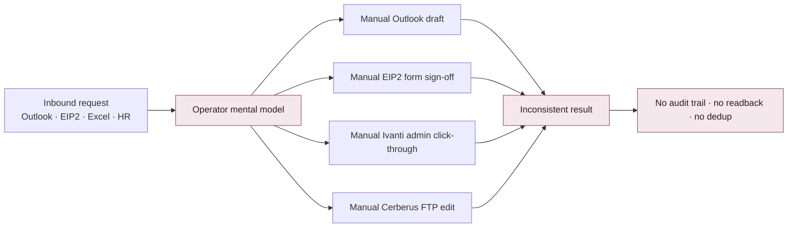
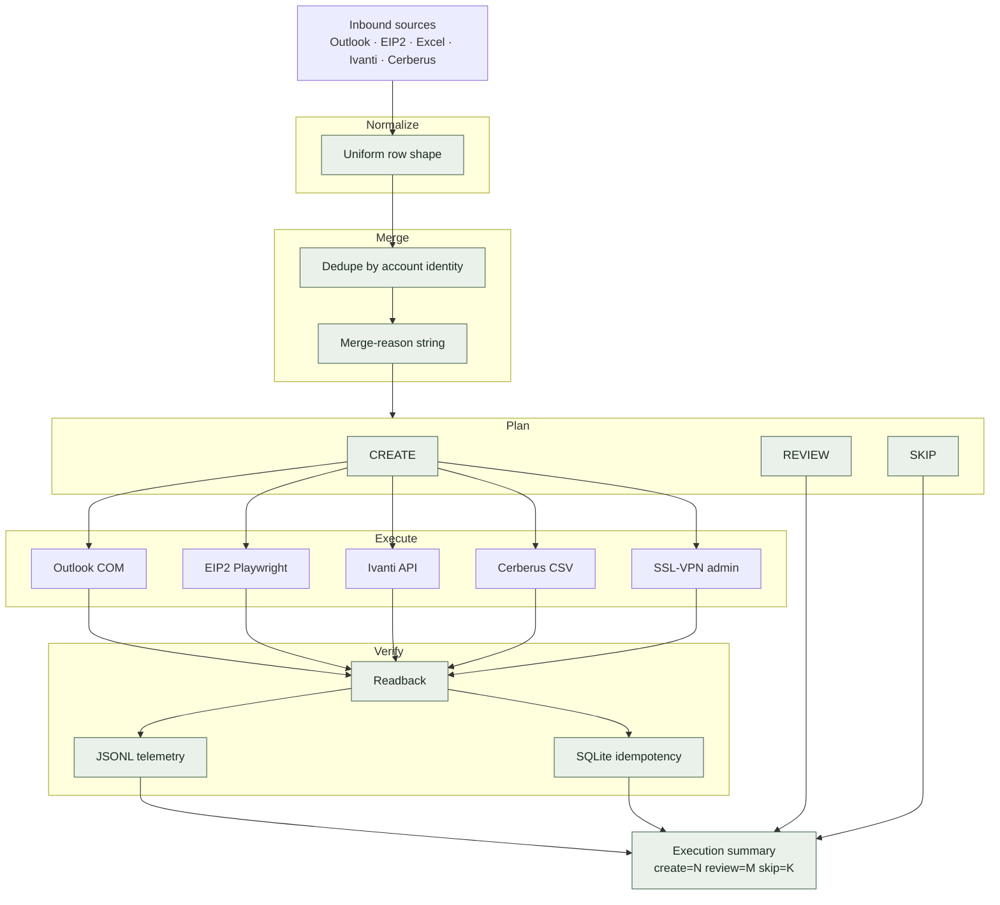
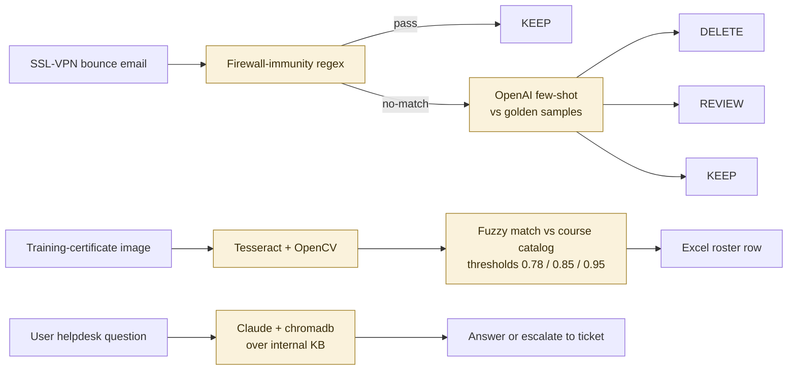
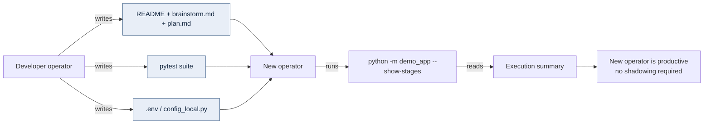

# Workflow Diagram

Before / after process flow for the consolidated Enterprise IT Helpdesk Automation Workbench.

---

## Before — request handling by memory

---

## After — batch-first workbench

---

## AI assist layer (sits beside intake, never decides external writes)

**Boundary rule.** The AI layer outputs a *label* (`DELETE / REVIEW / KEEP`), a *roster row*, or an *answer string*. It never calls a deterministic adapter. External writes only happen via the `Execute` block in the main workflow.

---

## Handoff path

